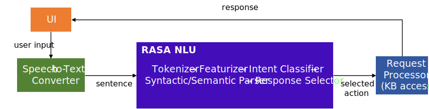
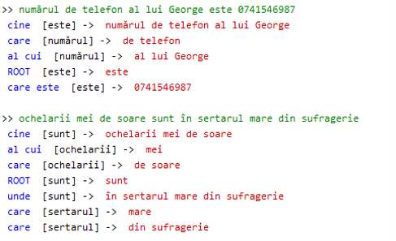
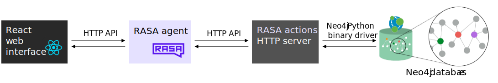

# Memory-assistant conversational agent

## Description

Conversational agent (for Romanian), able to store information received from the user through natural language
sentences (text/speech) in a knowledge graph and also able to extract this information when requested by the user.

#### Functions

##### Memorize
1. Determine the type of fact transmitted by the user
2. Extract relevant components of the fact as semantic entities
3. Represent the fact in a persistent knowledge base

##### Remember
1. Determine the type of the requested information
2. Extract semantic entities from the user’s sentence
3. Try to find the requested detail in the knowledge base and present it to the user

#### Architecture

##### Processing Pipeline



Pipeline:
- Web User Interface
- Convert speech to text (Web Speech API)
- Detect the **intent**
- Parse the input utterance (detect **syntactic functions**, using **syntactic parsing** 
(*=build the tree that reveals the syntactic functions of the words, together with the tokens they depend on*))



- Select response (custom action)
- Execute the action:
  - Select **semantic entities** relevant for the specific intent
  - Update/Query the **knowledge base** (graph database)

##### Implementation Architecture



## Project structure

* **rasa-bot** - This is the main project comprising the _conversational agent_
* **bot-frontend** - Web interface used to interact with the bot 
* **rasa-bot/drafts** - Contains the _syntactic parser_ (training code) and other draft files used to test various things
* **speech-to-text** - Proof of Concept of a JavaScript mini web-app that converts speech to text using the 
[Web Speech API](https://developer.mozilla.org/en-US/docs/Web/API/Web_Speech_API)
* **syntactic-annotator** - Annotating tool in the form of a web page (mostly JavaScript) used to label examples for syntactic parsing 
(attach questions like "cine?", "unde?", "când?", "ce?", "al cui?" etc. to the words of a given sentence)

## Running the bot

1. Start the Neo4j database
2. Start the RASA action server: ``rasa run actions``
3. Launch the RASA bot (HTTP server): ``rasa run -m models --enable-api --cors *`` or the interactive shell: ``rasa shell``
4. Type your utterances using the web UI (from _bot-frontend_ folder) or in the rasa shell

 
#### Manually testing the HTTP server

Endpoint: http://127.0.0.1:5005/webhooks/rest/webhook

Body format:
```json
{
    "sender": "Person",
    "message": "Aceasta este o propoziție"
}
```

## Evaluating the NLU pipeline

`rasa test nlu -u data\nlu_test.md`

## Updating the syntactic parser

All the training/evaluation code and datasets for the syntactic parser can be found in the file 
`rasa-bot/drafts/train_syntactic_parser.py`.